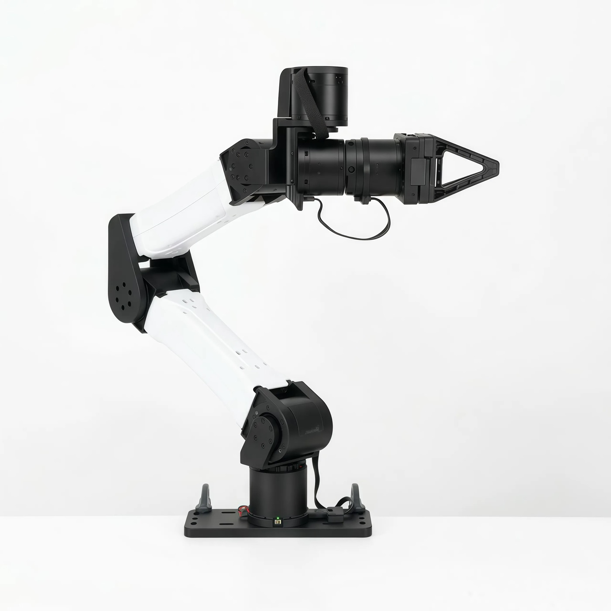
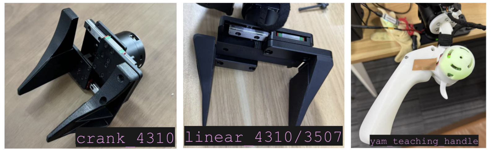
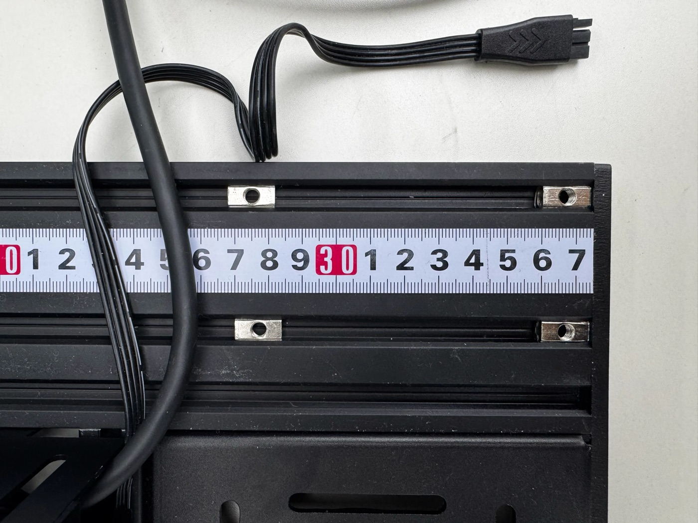
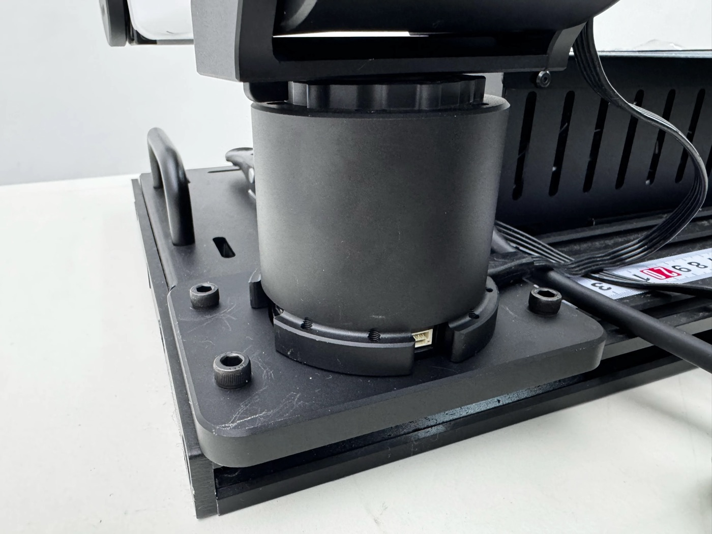
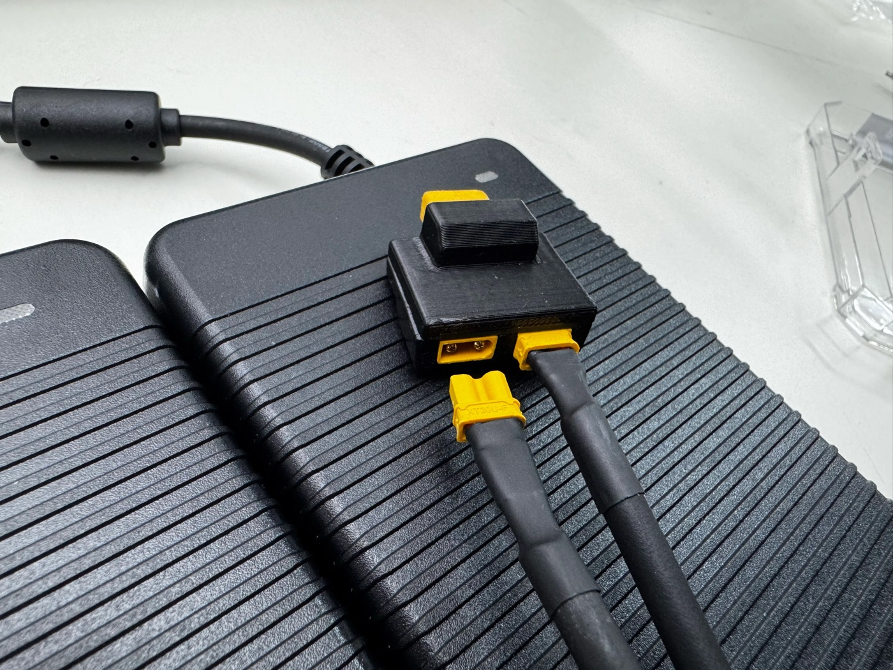
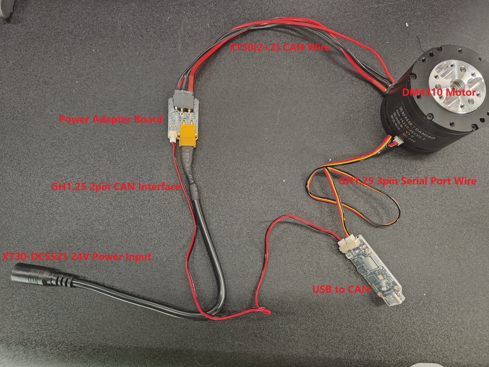
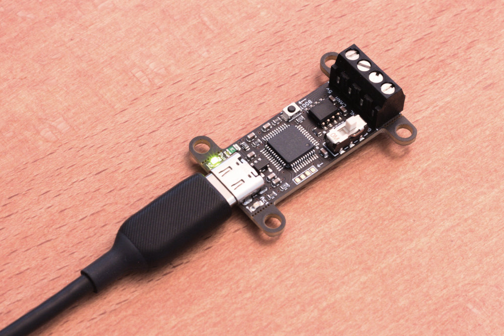
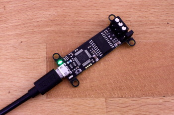
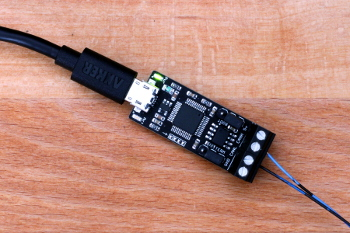
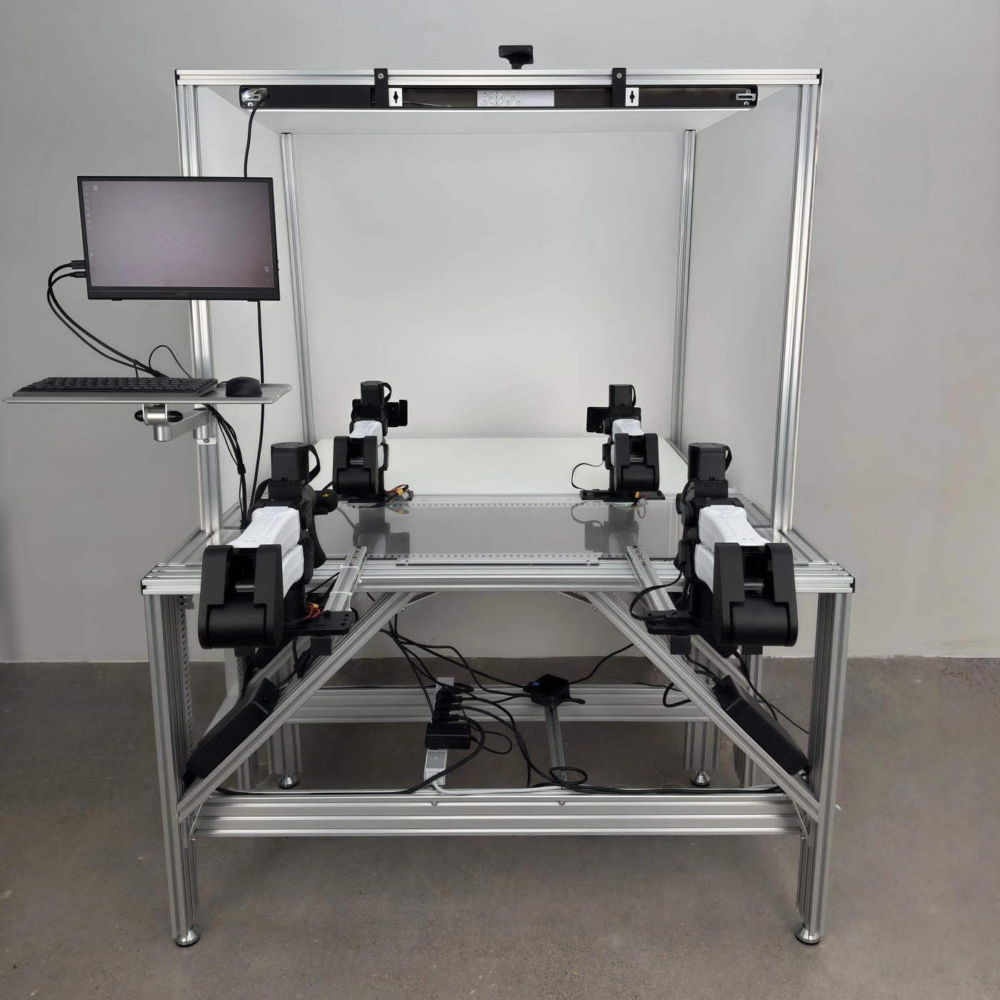

# CANable・YAM 配線ガイド（MolmoAct 2 Research Kit 用）

作成：2026-09-30　|　Status：**部品は現物確認済み（§2.3）、通電・通信は未検証**。現物で確認した項目はこのファイルに日付を入れて更新する。

> 対象：YAM Standard ×2（DM シリーズ CAN モータ、標準グリッパ）、2060 アルミフレーム、DGX Spark、Anker USB ハブ
> 表記：**【公式】** I2RT / canable.io / メーカー資料に書かれている。**【写真】** 公式写真から読み取れる。**【ユーザー報告】** 販売店や第三者の情報。**【未確認】** どの資料にも無く、現物で確かめる。
>
> **最初に知っておくこと**：I2RT の公式資料には、単体アーム用の「配線図・ピン配置・接続写真」は存在しない（doc.i2rt.com、GitHub、公開 Drive を 2026-09-30 に調査）。あるのは YAM Box（キャビネット型製品）の組立写真と、製品データシートだけ。以下はそれらと Damiao モータの一般的な構成から組み立てた手順なので、**現物と違う点があれば現物を優先し、写真を撮って記録する**。

## 1. 全体図

```text
                DGX Spark（Linux aarch64、gs_usb ドライバあり）
                ├─ USB-C 直挿し ──── RealSense ×3（帯域が要るので直挿し優先）
                └─ USB-C ──── Anker ハブ
                                ├─ USB ── CANable #L ──CAN── YAM Left  根元
                                └─ USB ── CANable #R ──CAN── YAM Right 根元

  AC ── [スイッチ付きタップ or E-stop] ── 24 V 電源 #L ── YAM Left  電源入力
  AC ── [スイッチ付きタップ or E-stop] ── 24 V 電源 #R ── YAM Right 電源入力
```

- **アーム 1 台につき CANable 1 個、24 V 電源 1 台**。CAN バスはアームごとに分ける【公式：YAM Cell ページ「1 アーム = 1 CAN チャンネル」、Research Kit データシート「each robotic arm independently powered」】。2 台を 1 本のバスに繋ぐと、両アームのモータ ID（1〜6）が衝突する【未確認：推論】。
- CAN は **1 Mbit/s**【公式】。
- カメラ直挿し・CANable はハブ、という振り分けは本プロジェクトの判断（reference.md §3.2）で、I2RT の指示ではない。

## 2. 部品の確認（開封時に写真を撮る）

### 2.1 各アームの箱に入っているはずのもの

YAM Standard のデータシート（I2RT 公開 Drive）の packing list【公式】：YAM 6-DOF アーム ×1、グリッパ ×1、予備グリッパ先端 ×2、**電源アダプタ ×1、CANable（USB-to-CAN）×1**、ほか。
一方、MolmoAct 2 Research Kit のデータシート packing list には電源・CANable の記載が無い【公式】。**つまり「アーム 2 箱それぞれに電源と CANable が入っている」はずだが、キット単位の資料では保証されていない**。開封時に必ず数える。

- [ ] 電源アダプタ ×2（定格ラベルの写真）
- [ ] CANable ×2（基板の写真、USB 端子の形状）
- [ ] アーム根元から出ているケーブル、または付属ケーブル（両端のコネクタの写真）
- [ ] グリッパ型式（下の写真と見比べる）

### 2.2 見た目の参考写真

| 部品 | 写真 | 読み取れること |
|---|---|---|
| YAM Standard 本体 |  | 製品写真【公式】。根元付近にケーブルと LED 付きの小コネクタ |
| グリッパの見分け方 |  | i2rt リポジトリ同梱【公式】。**左：crank_4310（指が湾曲）、中：linear_4310 / 3507（レール付きの直線指）、右：teaching handle**。本キットは linear 型の見込み |
| 根元から出るケーブル |  | YAM Box の組立写真【公式】。**4 芯フラットケーブルの先に 4 ピンの黒いプラグ**（XT30 (2+2) 型：太い 2 ピン = 電源、細い 2 ピン = CAN）【写真】 |
| 根元のソケット |  | 根元の円筒下部リングに**小さな白い多ピンソケット**（JST GH 系に見える）【写真】。名称・用途は【未確認】（CAN またはシリアルの可能性） |
| 24 V 電源 |  | ノート PC 型の 24 V ブリック ×2、**出力は黄色い XT30**。写真の黒い箱は YAM Box 用の並列アダプタ【公式】。本キットの電源が同じかは【未確認】。電流定格は販売店情報で 24 V / 15 A【ユーザー報告：UNIPOS】 |
| Damiao モータの標準配線 |  | Seeed の Damiao wiki【公式・ただし YAM ではない】。**XT30 (2+2) が電源 + CAN を 1 本で運び、分岐ボードで「DC 24 V 入力」と「CAN（GH1.25 2 ピン）→ USB-CAN」に分かれる** |
| CANable 2.0 |  | canable.io【公式】。USB-C、終端はスライドスイッチ |
| CANable Pro |  | canable.io【公式】。3 ピン端子台（CANH / CANL / GND）、終端はジャンパ |
| CANable 初代 |  | canable.io【公式】。micro-USB |
| 完成イメージ |  | YAM Station【公式】。ケーブルは根元で束ねてフレーム沿いに逃がしている |

**推定される接続トポロジ**【未確認：写真 + Damiao 標準構成からの推論】：
アーム根元の XT30 (2+2) ケーブル → 分岐（電源側 XT30 → 24 V アダプタ、CAN 側 → CANable）。分岐ケーブル／ボードがキットに入っているか、それとも CANable 側に XT30 (2+2) 受けが付いているかは、**現物を見ないと分からない**。

## 2.3 現物確認（2026-09-30、研究室の写真 `logs/photos-2026-09-30/1〜5`）

| 部品 | 確認結果 |
|---|---|
| 電源アダプタ | **24.0 V / 14.0 A（336 W）**、MODEL FY3292401400 系、入力 100–240 V、IEC 3 ピンの AC コード付き、**出力は黄色 XT30**。2 台あり（各アーム 1 台）【写真 3, 4】 |
| CANable | **USB-C**、透明熱収縮チューブ入りの小基板。MCU + CAN トランシーバ + **2×2 ピンヘッダ（ジャンパ付き、終端 or BOOT の可能性）** + **3 口の WAGO レバー端子**。端子には**赤・黒の 2 本だけ**が挿さっている（3 口目は空き = GND 未接続）【写真 2】。2 台あり【写真 4】 |
| 分岐ケーブル | CANable の赤黒 2 本と、**黄色 XT30（電源）** の赤黒 2 本が合流して **黒い 4 ピンプラグ（XT30 (2+2) 相当）** になっている。**= I2RT 製の「アーム ↔ 電源 + CANable」分岐ハーネス**。アーム根元の 4 芯ケーブルにこの黒プラグを挿す【写真 2】 |
| アーム | 2 台とも 2060 プロファイルに固定済み、中央にカメラポール。手首用カメラブラケット取付済み【写真 1】 |
| グリッパ | **リニアレール付きの直線指 = `linear_4310`（または 3507）**。SDK 既定の `linear_4310` で進める【写真 5】 |
| その他 | RealSense D405 ×2（箱）、Anker ハブ + AC アダプタ、UGREEN USB ケーブル、I2RT ラベル付き袋（予備部品）【写真 4】 |

**確定した接続**（1 アームあたり）：

```text
YAM 根元 4 芯ケーブル ──[黒 4 ピン]── I2RT 分岐ハーネス ──┬── 黄 XT30 ── 24 V 14 A アダプタ ── AC
                                                          └── 赤黒 2 本 ── WAGO 端子 ── CANable ── USB-C ── Anker ハブ ── Spark
```

未確定：2×2 ジャンパの意味（終端かどうか）、WAGO の 3 口目が GND か、アーム根元ケーブルの正確なコネクタ。**まず同梱状態のまま接続して通信できるか試し、ジャンパは触らない。**

## 3. CANable の準備（PC 側だけで先にできる）

1. **ファームウェア確認**。I2RT 同梱の CANable は candleLight 書き込み済み【公式：i2rt `docs/guides/set-persistent-can-ids.md`】。Spark に挿して：
   ```bash
   lsusb | grep -i "1d50:606f\|canable\|candle"   # candleLight は 1d50:606f
   ip -br link show type can                        # can0 が出れば gs_usb で認識
   ls /dev/ttyACM* 2>/dev/null                      # can0 が出ずこれが出るなら slcan ファーム
   ```
   slcan だった場合は https://canable.io/updater/ で candleLight に書き換える【公式】。
2. **機種の見分け方**【公式：各メーカー】：終端がスライドスイッチ → CANable 2.0 系、ジャンパ + USB 近くのボタン → Pro、ショートキャップ → MKS 系。**写真を撮って記録**。
3. **終端抵抗 120 Ω**。CAN バスは両端に 120 Ω が必要【公式：canable.io】。YAM 側に終端が入っているかは【未確認】。**全て無通電・CANable 未接続の状態で**、アーム側ケーブルの CAN_H–CAN_L 間をテスターで測る：
   - 約 120 Ω → アーム側に終端 1 つ → CANable の終端を **ON**
   - 約 60 Ω → 両端終端済み → CANable の終端を **OFF**
   - 開放 → I2RT に確認（support@i2rt.com）
   （判定の考え方は一般的な CAN の知識【未確認：推論】。まず同梱状態のスイッチ位置を写真に残し、それで通信できればそのままにする）
4. **5 V ピンは繋がない**。CANable の 5 V は出力専用。配線するのは CANH / CANL / GND で、**GND は必須**【公式：canable.io】。
5. USB 側：CANable の USB 端子形状を確認し、Anker ハブの給電可能ポートへ【reference.md §3.2】。

## 4. 1 本目（Left）の配線手順

1. **全ての電源を OFF**、AC も抜く。
2. アームのベースを机に固定（クランプ）。周囲 1 m を空け、ケーブルは可動範囲の外を通す【公式】。
3. アーム根元のケーブル（または付属ケーブル）を CANable に接続【公式：「CAN ケーブルでアームと CANable を接続」】。コネクタ名は【未確認】。自作・延長ケーブルを作る場合は CAN_H / CAN_L の入れ替わりに注意【ユーザー報告：Seeed】。
4. 24 V 電源をアームの電源入力に接続【公式】。**極性・コネクタ形状を写真で記録**。
5. CANable を Spark（Anker ハブ）の USB に接続。
6. AC を入れ、電源を ON。**各関節が一瞬「コッ」と鳴れば正常**【公式】。電源スイッチがどこにあるか（アダプタ側か本体側か）は【未確認】。
7. Spark で確認（reference.md §6.1 と同じ）：
   ```bash
   modinfo gs_usb | head -2
   ip link                                   # can0 が出るか
   sudo ip link set can0 up type can bitrate 1000000
   ip -details -statistics link show can0
   candump can0                              # 何か流れるか（Ctrl+C）
   ```
   `RTNETLINK answers: Device or resource busy` なら USB を挿し直すか `bash i2rt/scripts/reset_all_can.sh`【公式】。
8. 固定名を付ける（`can_follower_l`）。手順は reference.md §6.1。
9. 重力補償テスト（腕を手で支えながら）。手順は reference.md §6.3。

## 5. 2 本目（Right）の追加

1. Left の電源を切ってから、Right も同じ手順で。**別の CANable、別の 24 V 電源**。
2. `udevadm info -a -p /sys/class/net/can0 | grep -i serial` で Right の CANable の serial を取り、`can_follower_r` に固定。
3. 両方繋いで `ip link | grep can_follower` で 2 つとも見えることを確認。

## 6. 安全・注意

- **E-stop はキットに含まれない**【公式：Research Kit データシートに記載なし。ABC Kit の方には「hardware e-stop」あり】。MolmoAct2 公式 README も「e-stop released」を前提にしている。**各アームの 24 V 側に直列でラッチ式のキノコ型スイッチを入れるか、最低でもスイッチ付きタップを使う**【推奨】。ソフトの停止（Ctrl+C）は非常停止ではない。
- **活線での抜き差しは避ける**。CAN・電源とも、抜き差しは電源 OFF で【未確認だが安全側】。
- **400 ms タイムアウト**：指令が途絶えるとモータは damping モードに入る（工場出荷値）【公式】。無効化する場合の手順と条件は reference.md §10。
- ケーブルは根元で束ねて根元コネクタに力がかからないようにする【写真：YAM Station】。
- 通電前に緩み・誤接続・短絡が無いか確認【公式：YAM Box】。
- CAN の通信品質は i2rt の `scripts/check_can_usb_quality.py` で確認できる【公式：yam-abc-reproduce】。

## 7. 現物で確認するチェックリスト（写真を `logs/` に）

- [ ] 各アームの箱に 24 V 電源と CANable が 1 つずつ入っているか
- [ ] 根元ケーブルのコネクタ（XT30 (2+2) か、電源と CAN が別々か）と、分岐ケーブル／ボードの有無
- [ ] 電源アダプタの定格（V / A）と出力コネクタ、スイッチの有無
- [ ] CANable の機種、USB 端子形状、終端スイッチの初期位置、`lsusb` の ID
- [ ] CAN_H–CAN_L 間の抵抗値（無通電で）
- [ ] グリッパ型式（linear_4310 か）
- [ ] E-stop をどこに入れるか

## 8. 出典（2026-09-30 アクセス）

- https://doc.i2rt.com/products/yam / yam-standard / yam-cell / yam-box / motors
- https://doc.i2rt.com/getting-started/sw-setup.html
- https://github.com/i2rt-robotics/i2rt（README、`docs/guides/set-persistent-can-ids.md`、`assets/photos/yam_grippers.png`）
- https://github.com/i2rt-robotics/yam-abc-reproduce（`docs/hardware.md`）
- https://github.com/allenai/molmoact2/tree/main/examples/yam
- https://i2rt.com/products/molmoact-2-research-kit
- I2RT 公開 Drive（データシート PDF）：https://drive.google.com/drive/folders/1et1BCPRL1p-zUde3mMlmilPYLowDVnn3
- https://canable.io/getting-started.html 、https://github.com/candle-usb/candleLight_fw
- https://wiki.seeedstudio.com/damiao_series/
- https://www.unipos.net/products/yam-arm/
- https://docs.nvidia.com/dgx/dgx-spark/hardware.html

画像は上記サイトからの引用（`docs/images/`）。出典サイトの権利に従い、外部公開する場合はリンクに置き換える。
